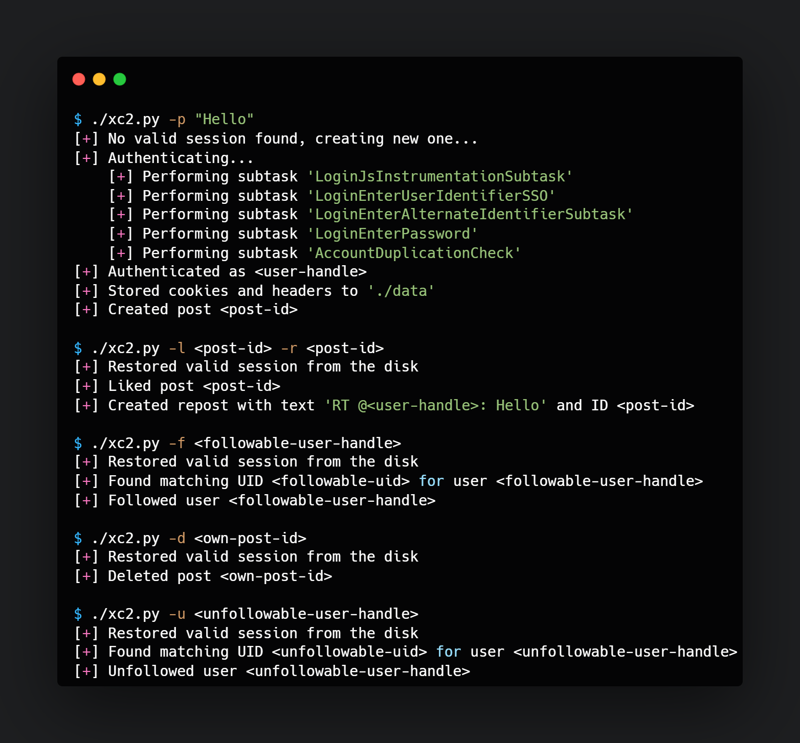

Working with public APIs can be a bit tedious at times. Especially as it seems to have become a trend [to raise API prices](https://techcrunch.com/2023/03/29/twitter-announces-new-api-with-only-free-basic-and-enterprise-levels/) in response to increasing amounts of bots and web scrapers. Though it's understandable from the business point of view, high base prices prevent the usage of such APIs in projects that aren't meant to be monetized. One way to get around this problem is to mimic the requests sent by a client browser instead of a using the API's OAuth2 solution.

By monitoring the HTTP traffic between the client browser and the server with `mitmproxy` I was able to see that after mimicing the authentication traffic, we'll be able to use the same GraphQL API endpoints as we'd with the official consumer API access. I collected the JSON formatted bodies of the notable requests and responses required to perform the client authentication, media upload, post creation, and post and user interactions.

## Client authentication

### Flow

All of the requests must contain an `Authorization` header with a hardcoded bearer token (same for every user).

1. POST request to `/guest/activate.json`, the response contains the `guest_token` in a header. The `guest_token` cookie is required to fetch the `flow_token` in the next step.
2. POST request to `/onboarding/task.json` with `flow_name=login` parameter, the response contains the `flow_token` in a header. The `flow_token` cookie must be attached to all authentication related requests.
3. Multiple POST requests to `/onboarding/task.json` to perform the authentication subtasks `LoginJsInstrumentationSubtask`, `LoginEnterUserIdentifierSSO`, `LoginEnterAlternateIdentifierSubtask` (optional), `LoginEnterPassword`, `AccountDuplicationCheck`, and `LoginAcid` (optional).
4. POST request to `/i/api/graphql/93NdfGgZRSyQ-6rmHPgdNg/Viewer`, the response contains the `ct0` cookie. The `ct0` cookie is required to perform any of the actual client functionality. The cookie's value is also attached to a `X-CSRF-Token` header.

```json
// Subtask 1 (LoginJsInstrumentationSubtask)
"js_instrumentation": {
    "link": "next_link",
    "response": {
        "rf": {
            "ab8e89b3ae0d58ea1a1513ee59d7740ede65ac3398422167734dd9324a5fc755":-226,
            "a54c70d9927a36ae9d89b2f9195e028937f80894c19146fd36940f7a7ccbff40":-97,
            "f0cb2da814518d2fe69debdcabbcb89e23f892e9bc3de3f0e96f38b8b019ce23":-68,
            "a79d69e899073b51513008cda84efc7dac995fdac92142e8c7e6787f82eee596":-37
        },
        "s":"P1OudzcHlw9YXoO43BVSvBXNyOGi38NDrDngXhvg_AHoGyY7P2Hcfa3b8aqODDXvJXkhgyLH7AOVyz90ZD5814DnWIU34j0QqRpufhReTj5shdDxPQQGX60BFjv-84HPalsrkflALpb0TFlZEfPtHRaPEIZVUB19egSlKbIviXdUY02QJzXDK807PK1qCNYdjrBSA-QEIVw38ahxukfO8BsGfNBikhkhI1HtnUhefTrfpVYjBHNBVjCGlpDv-EQXWBQV7L1Muu1tiIljSVfUkOUfFBZr0J1AqZImNDyhZNYSvKDYgbthM1VWTzZYZYfdHso87QGVQEugph93cGgI9QAAAYnv721O"
    }
}
```

```json
// Subtask 2 (LoginEnterUserIdentifierSSO)
"settings_list": {
  "link": "next_link",
  "setting_responses": [
    {
      "key": "user_identifier",
      "response_data": {
        "text_data": {
          "result": "<your-email>"
        }
      }
    }
  ]
}
```

```json
// Subtask 3 (LoginEnterAlternateIdentifierSubtask, optional)
"enter_text": {
  "link": "next_link",
  "text": "<your-alternate-id>"
}
```

```json
// Subtask 4 (LoginEnterPassword)
"enter_password": {
  "link": "next_link",
  "password": "<your-password>"
}
```

```json
// Subtask 5 (AccountDuplicationCheck)
"check_logged_in_account": {
  "link": "AccountDuplicationCheck_false"
}
```

```json
// Subtask 6 (LoginAcid, optional)
"enter_text": {
  "link": "next_link",
  "text": "<confirmation-code-from-email>"
}
```

### Storing tokens

To minimize the amount of authentication traffic, it's wise to store and reload the request headers and cookies from the local disk (e.g. as a JSON). Validity of the restored tokens can easily be checked by querying the `lFi3xnx0auUUnyG4YwpCNw/GetUserClaims` GraphQL endpoint with an empty POST request. Getting rid of unnecessary authentication flows greatly reduces the risks of the account getting "locked" (requiring the `LoginAcid` subtask with an email challenge during the next login).

## Automating the functionality

### Media upload

Post attachments (in this case images or videos) must be uploaded separately from the actual `CreateTweet` request. [The attachments can be at most 512 MB and must be split into chunks of 1 MB](https://developer.twitter.com/en/docs/tutorials/uploading-media).

```json
// Step 1: POST request to /i/media/upload.json
{
  "command": "INIT",
  "media_type": "<'image'-or-'video'>/<file-extension>",
  "total_bytes": "<total-bytes",
  "media_category": "<'tweet_image'-or-'tweet_video'>"
}
```

```json
// Step 2: POST request(s) to /i/media/upload.json (individual request for each chunk)
{
  "command": "APPEND",
  "media_id": "<media-id>",
  "segment_index": "<incrementing-chunk-index>"
}
```

```json
// Step 3: POST request to /i/media/upload.json
{
  "command": "FINALIZE",
  "media_id": "<media-id>"
}
```

```json
// Step 4: POST request to /i/media/upload.json
{
  "command": "STATUS",
  "media_id": "<media-id>"
}
```

```json
// Example response indicating that the file has been successfully processed
{
  "media_id": "<media-id>",
  "media_id_string": "<media-id-string>",
  "media_key": "<media-key>",
  "processing_info": {
    "check_after_secs": 1,
    "progress_percent": 5,
    "state": "succeeded"
  }
}
```

### Post creation

```json
// Example POST request to SoVnbfCycZ7fERGCwpZkYA/CreateTweet GraphQL endpoint
{
  "features": {
    "freedom_of_speech_not_reach_fetch_enabled": true,
    "graphql_is_translatable_rweb_tweet_is_translatable_enabled": true,
    "longform_notetweets_consumption_enabled": true,
    "longform_notetweets_inline_media_enabled": true,
    "longform_notetweets_rich_text_read_enabled": true,
    "responsive_web_edit_tweet_api_enabled": true,
    "responsive_web_enhance_cards_enabled": false,
    "responsive_web_graphql_exclude_directive_enabled": true,
    "responsive_web_graphql_skip_user_profile_image_extensions_enabled": false,
    "responsive_web_graphql_timeline_navigation_enabled": true,
    "responsive_web_media_download_video_enabled": false,
    "responsive_web_twitter_article_tweet_consumption_enabled": false,
    "standardized_nudges_misinfo": true,
    "tweet_awards_web_tipping_enabled": false,
    "tweet_with_visibility_results_prefer_gql_limited_actions_policy_enabled": true,
    "tweetypie_unmention_optimization_enabled": true,
    "verified_phone_label_enabled": false,
    "view_counts_everywhere_api_enabled": true
  },
  "queryId": "SoVnbfCycZ7fERGCwpZkYA",
  "variables": {
    "dark_request": false,
    "media": { "media_entities": [], "possibly_sensitive": false },
    "semantic_annotation_ids": [],
    "tweet_text": "<your-tweet-text>"
  }
}
```

```json
// Example response indicating the post is created and is queryable
{
  "data": {
    "create_tweet": {
      "tweet_results": {
        "result": {
          // **User data stripped**
          "edit_control": {
            "edit_tweet_ids": ["<post-id>"],
            "editable_until_msecs": "1692357491000",
            "edits_remaining": "5",
            "is_edit_eligible": true
          },
          "is_translatable": false,
          "legacy": {
            "bookmark_count": 0,
            "bookmarked": false,
            "conversation_id_str": "<post-id>",
            "created_at": "<post-creation-date>",
            "display_text_range": [0, 15],
            "entities": {
              "hashtags": [],
              "symbols": [],
              "urls": [],
              "user_mentions": []
            },
            "favorite_count": 0,
            "favorited": false,
            "full_text": "<post-text>",
            "id_str": "<post-id>",
            "is_quote_status": false,
            "lang": "en",
            "quote_count": 0,
            "reply_count": 0,
            "retweet_count": 0,
            "retweeted": false,
            "user_id_str": "<user-id>"
          },
          "rest_id": "<post-id>",
          "source": "<a href=\"https://mobile.twitter.com\" rel=\"nofollow\">Twitter Web App</a>",
          "unmention_info": {},
          "views": {
            "state": "Enabled"
          }
        }
      }
    }
  }
}
```

### Post interactions

```json
// POST request to lI07N6Otwv1PhnEgXILM7A/FavoriteTweet GraphQL endpoint
{
  "queryId": "lI07N6Otwv1PhnEgXILM7A",
  "variables": {
    "tweet_id": "<post-id>"
  }
}
```

```json
// POST request to ojPdsZsimiJrUGLR1sjUtA/CreateRetweet GraphQL endpoint
{
  "queryId": "ojPdsZsimiJrUGLR1sjUtA",
  "variables": {
    "dark_request": false,
    "tweet_id": "<post-id>"
  }
}
```

```json
// POST request to VaenaVgh5q5ih7kvyVjgtg/DeleteTweet GraphQL endpoint
{
  "queryId": "VaenaVgh5q5ih7kvyVjgtg",
  "variables": {
    "dark_request": false,
    "tweet_id": "<post-id>"
  }
}
```

### User interaction

```json
// GET request to _pnlqeTOtnpbIL9o-fS_pg/ProfileSpotlightsQuery GraphQL endpoint
{
  "variables": {
    "screen_name": "<user-handle>"
  }
}
```

```json
// POST request to /i/api/1.1/friendships/destroy.json
{
  "user_id": "<user-id-fetched-above>"
}
```

```json
// POST request to /i/api/1.1/friendships/destroy.json
{
  "user_id": "<user-id-fetched-above>"
}
```

## Python implementations

- [My Python implementation](https://github.com/17ms/xc2)
- [A proper Python library created by Trevor Hobenshield](https://github.com/trevorhobenshield/twitter-api-client/)


